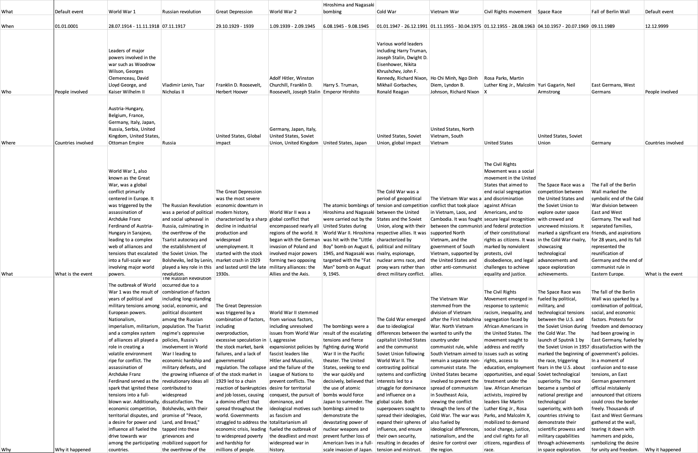

# HistoryHelper2
This code will help you in creating your personal history revision book with all needed information about historic events. You will be able to add any events you want by just typing its name in the console. The end result will look like this:



## Setup guide:
1. Download the project, unzip the file, and open the HistoryHelper folder, which is inside HistoryHelper2-main folder, in your editor (e.g. VS Code). 
2. Open the terminal, and run these lines of code to install all libraries:

Mac:
```
python3 -m venv venv
source venv/bin/activate
pip3 install -r requirements.txt
brew install python-tk
```

Windows:
```
python3 -m venv venv
myenv\Scripts\activate
pip3 install -r requirements.txt
sudo apt-get install python3-tk
```

5. Run the AI2.py file by clicking the run button in VS Code or writing ```python3 AI2.py```
6. Once you run it for the first time, open the new popped-up window and click Toggle Configuration button.
7. Choose the excel file path you want to use (If you don't have any other files made by the HistoryHelper2, just use the default one in the HistoryHelper2 folder) and the openai api key, which you can create by clicking the get openai api key button.
8. Click update configuration button to save the changes.
9. You are all set! Now you are ready to generate event information!

## Generating events info
To generate information about the event, write events you would like to add to your excel file in the empty field at the top, and separate different events with a semicolon. Next, click Process Events button. When the information is generated, check if it is correct and click apply changes when ready.

## Warnings:
Remember that the excel file structure should be as in History file, otherwise the code will not work properly. <br />There should be no empty colons between the events. <br />Do not delete the first and last Null events. <br /> Be careful about the date of the event, it should always be in the format xx.yy.zzzz or xx.yy.zzzz - end date.

## How to use it
This project helped me improve my history grades from a C- to a B+ without having to put in a lot of extra work. I no longer needed to read through numerous presentations filled with useless information. This is how I used it to improve my efficiency: first, I quickly went through the syllabus for our classes without delving too deep into it. I only looked for events or terms that I didn't know. As soon as I came across something new, I inputted it into the code and it automatically added it to my file. Then, I reviewed all the events and terms in the file, only focusing on the names I didn't remember. If I came across something I didn't remember, I looked at all the information below and repeated this process until I remembered everything. This method is beneficial because you don't need to read all the extra information written in the books or presentations that you won't need. This only gives you the useful information.

## Thank you for visiting the page
I hope this code will help you in improving your history grades while decreasing the preparation time as well as it did for me. If you like my project, please give it a star so that I know it helped someone. Good luck!
